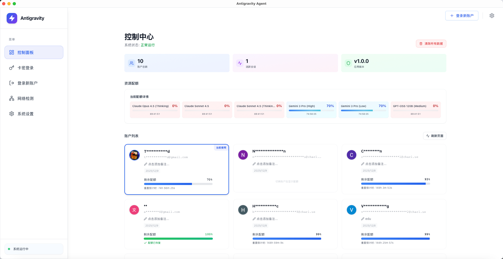

# Antigravity Agent - 续杯定制版

<div align="center">


**Antigravity 账号与配置文件管理工具 - 增强版**

一个基于 Tauri 构建的跨平台桌面应用，帮助您轻松管理 Antigravity 账号、备份用户配置文件，并提供卡密登录、配额监控等增强功能。

[](LICENSE)
[]()
[](https://tauri.app/)
[](https://reactjs.org/)
[](https://github.com/MonchiLin/antigravity-agent)

[下载安装](#-下载安装) • [功能特性](#-功能特性) • [二次开发说明](#-二次开发说明) • [开发指南](#-开发指南) • [构建发布](#-构建发布)

</div>

---

## 📖 项目说明

本项目基于 [MonchiLin/antigravity-agent](https://github.com/MonchiLin/antigravity-agent) 进行二次开发，在原有功能基础上新增了以下特性：

- 🎫 **卡密登录系统** - 支持通过卡密快速登录账号
- 📊 **配额仪表盘** - 实时监控账号配额使用情况
- 🔍 **网络诊断工具** - 内置网络连接检测和故障排查
- 🔗 **后端集成** - 支持与自定义后端服务对接
- 💳 **密码导入导出** - 批量管理账号密码
- ⏰ **到期提醒** - 账号到期自动提醒功能
- 🎨 **UI 优化** - 更现代化的界面设计和交互体验

感谢原作者 [MonchiLin](https://github.com/MonchiLin) 提供的优秀开源项目！

---

## ✨ 功能特性

### 核心功能（继承自原项目）

- 🔐 **账号管理** - 安全管理多个 Antigravity 账号
- 💾 **配置备份** - 一键备份和恢复用户配置文件
- 🚀 **自动更新** - 内置自动更新功能，始终保持最新版本
- 🎨 **现代界面** - 基于 React + TailwindCSS 的精美 UI
- ⚡ **高性能** - Rust 后端 + React 前端，快速响应
- 🌍 **跨平台** - 支持 Windows、macOS、Linux

### 增强功能（二次开发新增）

#### 🎫 卡密登录系统
- 支持通过卡密快速登录 Antigravity 账号
- 自动获取账号信息和配额
- 支持卡密有效期管理
- 与后端服务无缝对接

#### 📊 配额监控仪表盘
- 实时显示账号配额使用情况
- 可视化进度条展示
- 自动刷新配额信息
- 支持手动和自动补充配额

#### 🔍 网络诊断工具
- 检测 Antigravity 客户端连接状态
- 端口可用性检测
- CSRF Token 验证
- 详细的错误诊断信息

#### 🔗 后端服务集成
- 支持自定义后端 API 地址配置
- 卡密验证和账号绑定
- 配额查询和管理
- 用户反馈系统

#### � 密码管理增强
- 批量导入账号密码（支持 JSON 格式）
- 批量导出账号密码
- 密码加密存储
- 支持备注和分组管理

#### ⏰ 智能提醒
- 账号到期自动提醒
- 配额不足预警
- 系统更新通知
- 可自定义提醒规则

---

## �📥 下载安装

### 正式版本

访问 [Releases 页面](https://github.com/hutututtt/-/releases/latest) 下载最新版本：

| 平台 | 下载 | 说明 |
|------|------|------|
| **Windows** | `Antigravity Agent_x.x.x_x64-setup.exe` | 安装版，支持自动更新 |
| **Windows** | `Antigravity-Agent-x86_64-Portable.zip` | 便携版，解压即用 |
| **macOS (Apple Silicon)** | `Antigravity Agent_x.x.x_aarch64.dmg` | M1/M2/M3 芯片 |
| **macOS (Intel)** | `Antigravity Agent_x.x.x_x86_64.dmg` | Intel 芯片 |
| **macOS (Universal)** | `Antigravity Agent_x.x.x_universal.dmg` | 通用版本（推荐） |
| **Linux** | `antigravity-agent_x.x.x_amd64.AppImage` | 通用格式 |
| **Linux (Debian/Ubuntu)** | `antigravity-agent_x.x.x_amd64.deb` | Debian 包 |

### macOS 安装提示

Mac 用户如果遇到"应用已损坏"的提示：

```bash
# 使用终端移除隔离属性
xattr -cr /Applications/Antigravity\ Agent.app
```

---

## 🔧 二次开发说明

### 主要改动

本项目在原版基础上进行了以下主要改动：

#### 1. 新增组件
- `CardKeyLoginDialog.tsx` - 卡密登录对话框
- `QuotaDashboard.tsx` - 配额仪表盘
- `QuotaProgressBar.tsx` - 配额进度条
- `NetworkCheckDialog.tsx` - 网络诊断对话框
- `ExpirationBanner.tsx` - 到期提醒横幅
- `ExportPasswordDialog.tsx` - 密码导出对话框
- `ImportPasswordDialog.tsx` - 密码导入对话框

#### 2. 后端功能扩展
- 新增卡密验证 API 集成
- 新增配额查询和管理功能
- 新增用户反馈系统
- 增强了内存读取和进程管理能力

#### 3. 数据存储
- 使用 SQLite 存储账号信息
- 支持密码加密存储
- 新增配额缓存机制
- 支持自定义配置持久化

#### 4. 网络功能
- 集成 HTTP 客户端（reqwest）
- 支持自定义后端 API 地址
- 新增网络连接诊断工具
- 支持代理配置

### 技术栈

- **前端框架**: React 18.3 + TypeScript
- **UI 框架**: TailwindCSS + Radix UI
- **桌面框架**: Tauri 2.9
- **后端语言**: Rust
- **状态管理**: Zustand
- **数据库**: SQLite (rusqlite)
- **HTTP 客户端**: reqwest
- **日志系统**: tracing

### 配置文件

项目使用以下配置文件：

- `.env` - 环境变量配置（后端 API 地址等）
- `src-tauri/tauri.conf.json` - Tauri 应用配置
- `tailwind.config.js` - TailwindCSS 配置

### 后端 API 集成

如需对接自定义后端，请在 `.env` 文件中配置：

```env
VITE_API_BASE_URL=http://your-backend-api.com
```

后端需要提供以下 API 接口：

- `POST /api/card/verify` - 卡密验证
- `GET /api/quota/query` - 配额查询
- `POST /api/feedback/submit` - 反馈提交

详细的 API 文档请参考项目 Wiki。

---

## 🛠️ 开发指南

### 环境要求

- **Node.js**: >= 18.0.0
- **Rust**: >= 1.70.0
- **npm**: >= 9.0.0

### 安装依赖

```bash
# 安装前端依赖
npm install

# 安装 Rust 工具链（如果尚未安装）
curl --proto '=https' --tlsv1.2 -sSf https://sh.rustup.rs | sh
```

### 开发模式

```bash
# 启动开发服务器
npm run tauri:dev
```

### 代码结构

```
antigravity-agent/
├── src/                      # React 前端代码
│   ├── components/          # React 组件
│   │   ├── business/       # 业务组件（新增）
│   │   ├── base-ui/        # 基础 UI 组件
│   │   └── ui/             # Radix UI 组件
│   ├── lib/                # 工具函数
│   ├── stores/             # Zustand 状态管理
│   └── App.tsx             # 主应用组件
├── src-tauri/              # Rust 后端代码
│   ├── src/
│   │   ├── commands/       # Tauri 命令
│   │   ├── utils/          # 工具函数
│   │   └── main.rs         # 主入口
│   ├── Cargo.toml          # Rust 依赖配置
│   └── tauri.conf.json     # Tauri 配置
└── package.json            # Node.js 依赖配置
```

---

## 📦 构建发布

详细的构建说明请参考 [BUILD.md](BUILD.md)。

### 快速构建

```bash
# macOS Universal 版本（推荐）
npm run tauri build -- --target universal-apple-darwin

# Windows 版本
npm run tauri build

# Linux 版本
npm run tauri build
```

### 自动化构建

项目配置了 GitHub Actions 自动构建流程：

1. 创建版本标签并推送
2. GitHub Actions 自动构建所有平台安装包
3. 自动创建 Release 并上传安装包

```bash
git tag v1.0.0
git push origin v1.0.0
```

---

## 🤝 贡献

欢迎提交 Issue 和 Pull Request！

### 贡献指南

1. Fork 本项目
2. 创建特性分支 (`git checkout -b feature/AmazingFeature`)
3. 提交更改 (`git commit -m 'Add some AmazingFeature'`)
4. 推送到分支 (`git push origin feature/AmazingFeature`)
5. 提交 Pull Request

---

## 📄 开源协议

本项目采用 MIT 协议开源，详见 [LICENSE](LICENSE) 文件。

---

## 🙏 致谢

- 感谢 [MonchiLin](https://github.com/MonchiLin) 提供的原始项目 [antigravity-agent](https://github.com/MonchiLin/antigravity-agent)
- 感谢 [Tauri](https://tauri.app/) 团队提供的优秀桌面应用框架
- 感谢所有为本项目做出贡献的开发者

---

## 📞 联系方式

如有问题或建议，欢迎通过以下方式联系：

- 提交 [Issue](https://github.com/hutututtt/-/issues)
- 发送邮件至项目维护者

---

<div align="center">

**⭐ 如果这个项目对您有帮助，请给它一个星标！**

Made with ❤️ by the Antigravity Agent Team

</div>
